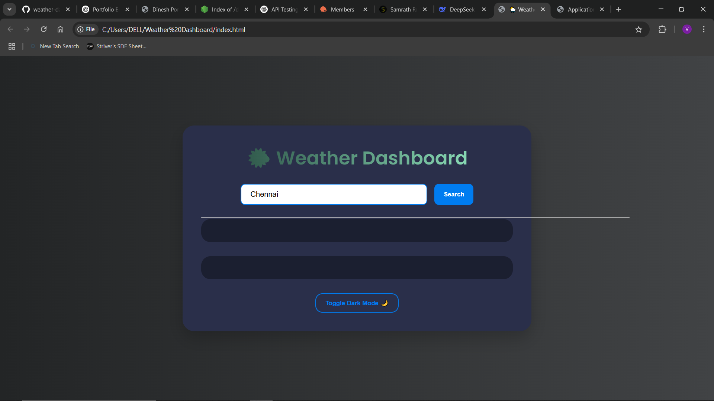
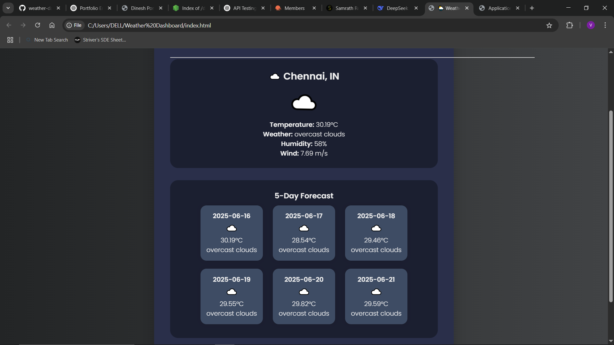

# 🌦️ Weather Dashboard

A responsive and modern weather dashboard built with HTML, CSS, and JavaScript.  
It fetches live weather data using the OpenWeatherMap API and displays current temperature, weather icons, and conditions based on user input.

---

## 🔗 Live Demo

👉 [View Live Project](https://dinesh15-hub.github.io/weather-dashboard/)

---

## 📸 Output Screenshots

| Home View | Weather Detail View |
|-----------|---------------------|
|  |  |

---

## 🚀 Features

- 🔍 Search weather by city name
- 🌡️ Displays real-time temperature, conditions, and weather icons
- 📱 Fully responsive UI
- 🌐 Uses OpenWeatherMap API for real-time data

---

## 🛠️ Tech Stack

- 💻 HTML5
- 🎨 CSS3
- ⚡ JavaScript (Vanilla JS)
- ☁️ OpenWeatherMap API

---

## 📁 Folder Structure

